# OutreachIQ – Email Outreach Automation Builder

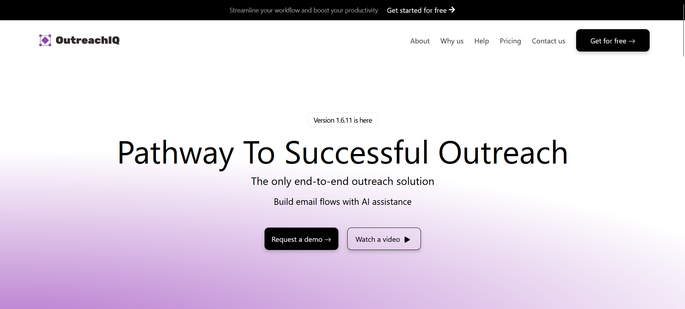

---


### Table of Contents

- [Description](#description)
- [Tech Stack](#tech-stack)
- [Features](#features)
- [Directory Structure & Architecture](#directory-structure--architecture)
- [Screenshots](#screenshots)
- [Local Development & Setup](#local-development--setup)
- [Future scope](#future-scope)
- [License](#license)
- [Feedback](#feedback)

---

### Description
OutreachIQ is a fullstack email automation flow creator platform that enables users to design, schedule, and track multi-step outreach campaigns.  
With a visual flow builder, lead targeting, and real-time analytics, OutreachIQ streamlines cold email outreach workflows for startups.  

---

### Tech Stack
- **React + TailwindCSS** → Fast, modern UI development with utility-first styling  
- **Node.js + Express** → Scalable backend for APIs
- **MongoDB** → Flexible document store for leads, flows, users, etc.
- **Agenda** → Powerful job scheduler with MongoDB persistence for async tasks  
- **React Router** → SPA routing with protected routes and nested flows  
- **LocalStorage + Context API** → Lightweight session persistence & global state management  
- **Redis** → In-memory caching layer for low latency responses
- **Docker** → Containerize Redis for consistent dev and prod environments
---

### Features
- **Authentication & Authorization** – Registration and secure login with json web tokens (JWT), cookies and middleware. Forget password management with email reset link 
- **Email Scheduling** – Async job scheduling using Agenda + MongoDB for reliable email delivery 
- **Analytics Dashboard** – Tracks quick stats such as total jobs, completed, failed, etc. Graphs to show trends such as flow creation and email delivery.
- **Flow Builder** – Create and connect nodes into automated outreach sequence.
- **Lead Management** – Import and parse leads from CSV to create campaigns, with preview functionality for a better user experience.  
- **Settings Page** – Updating configurations, and account preferences  
- **Logging & Error Handling** – Custom logger for structured jsonl logs increasing observability

---

### Directory Structure & Architecture

**Directory details**
- **client/** – React frontend with Tailwind CSS
- **pages** – Route-based views 
- **components** – Reusable UI 
- **contexts** – Global state management to prevent props drilling
- **utils(client)** – Helpers, constants, and utility functions 
- **data** - JSON files for static data and email templates
- **server/** – Node.js + Express backend web server with RESTful APIs 
- **config** – Central configurations for env variables and instances
- **services** – Core business logic and interaction with database models  
- **models** – Flexible mongoose schemas   
- **routes** – REST API endpoints 
- **utils(server)** – Logger, constants, error handling functions  


**Architecture at a glance:**  
- **Frontend (React):** Handles UI, state management, client side rendering (CSR) and routing.  
- **Backend (Node + Express):** REST APIs, authentication, job scheduling, DB persistence.  
- **Job Scheduler (Agenda):** Runs background tasks like sending emails at scheduled times, check job success and failures.  
- **NoSQL Database (MongoDB):** Stores users, flows, leads, and scheduled jobs metadata.
- **Caching (Redis):** Caching layer to improve response times and reduce redundant database queries. 

---

### Screenshots

##### Sign Up and Sign In pages for user registration and authentication
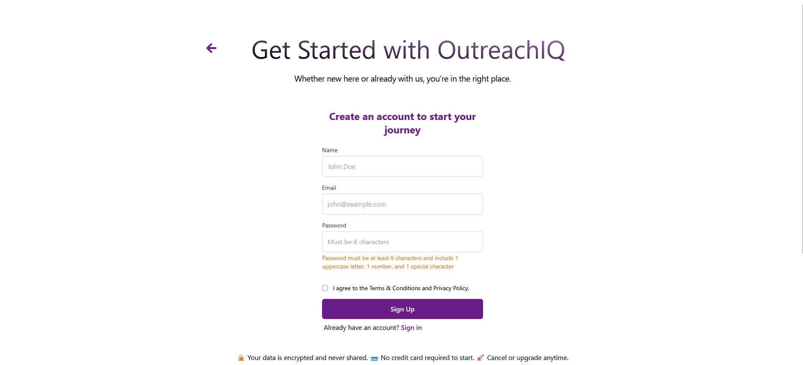

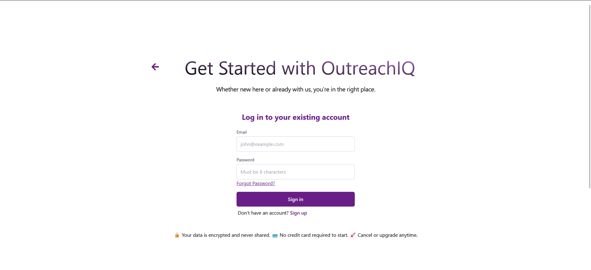


##### Forget password page to send reset link to user via email


##### Dashboard after login with Flow Creator Canvas, Left Sidebar and Right Sidebar
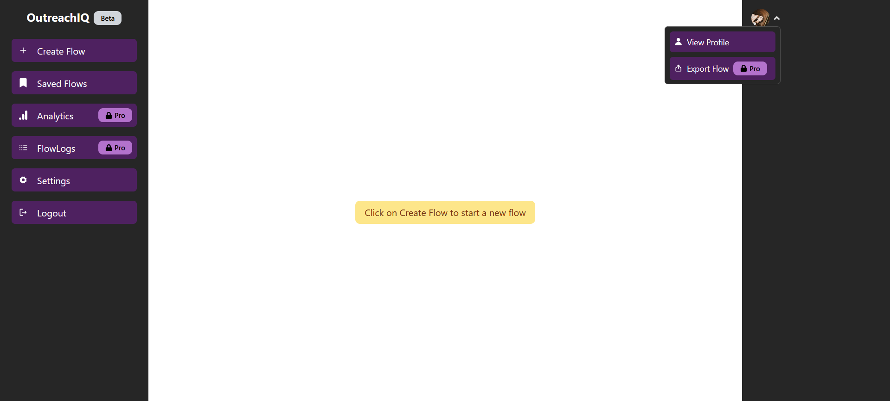


##### Create new flow to build a new sequence of outreach emails 
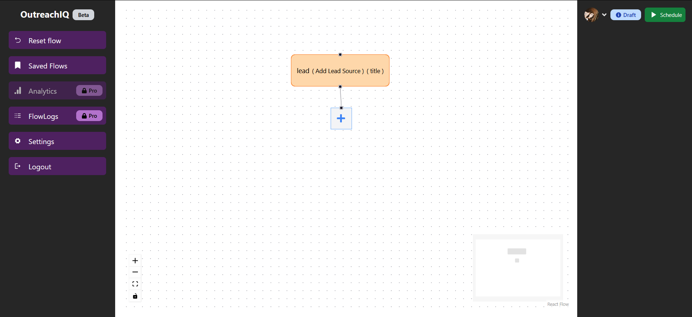


##### Choose lead source


##### Add leads from CSV file


##### Preview leads
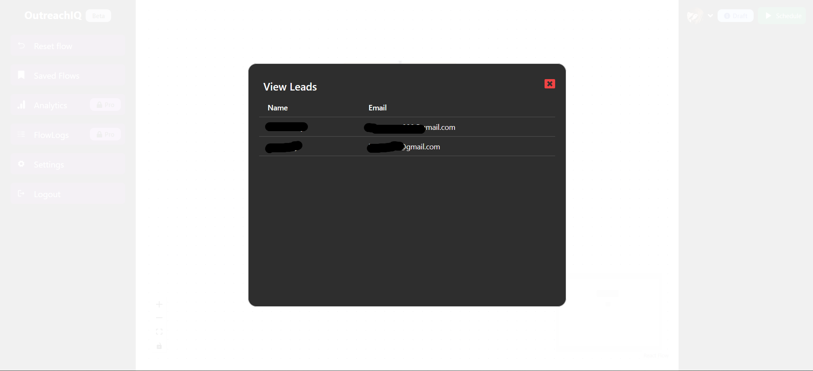


##### Create a new block
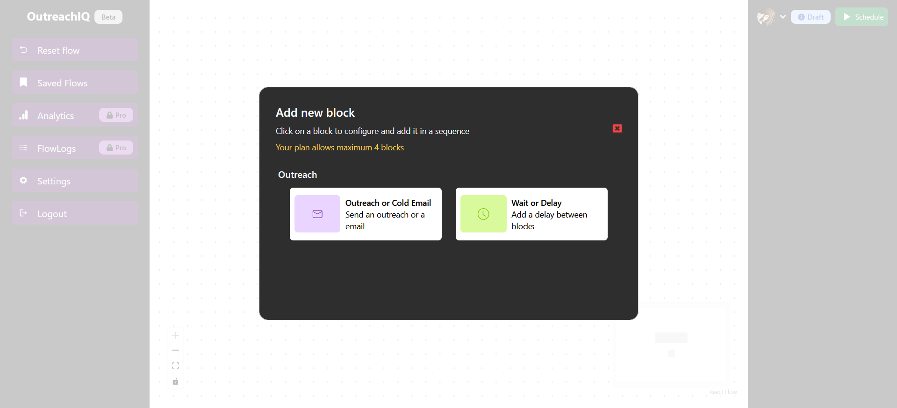


##### Create email block with title, subject, body and variables.
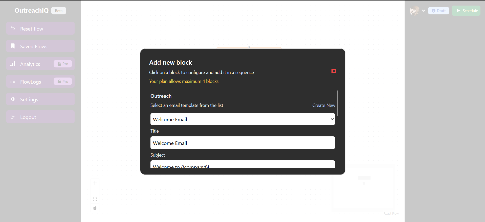


##### Choosing pre-built email templates
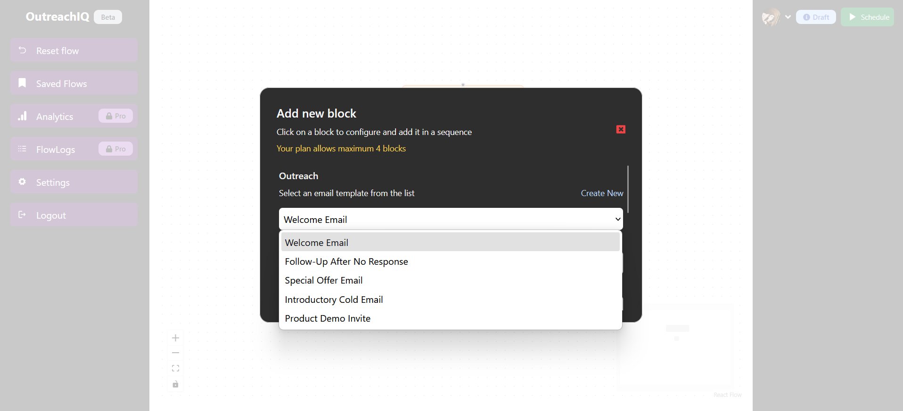


##### Use placeholders in the template 
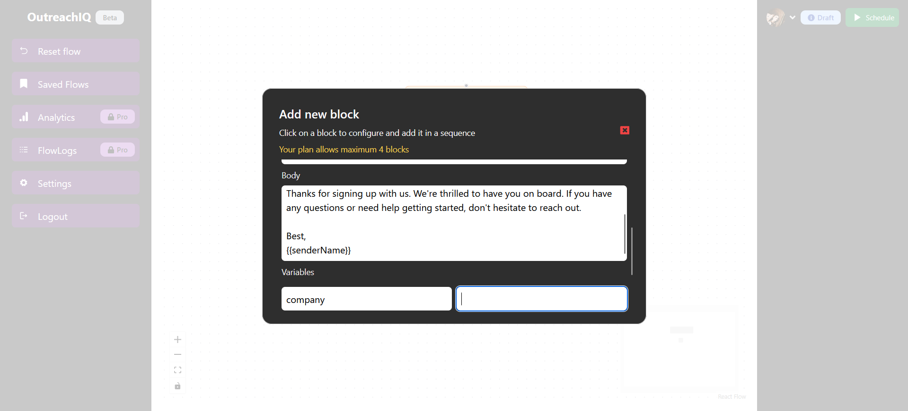


##### Create custom template with full control 
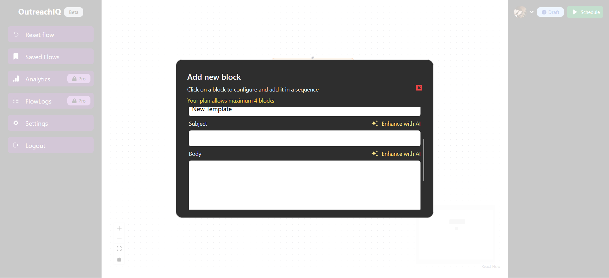


##### Create wait block with delay and format 
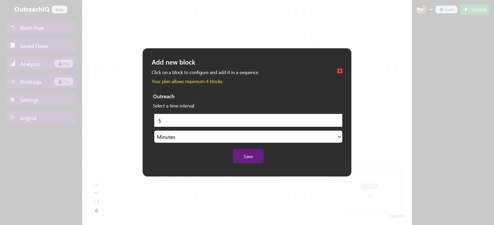


##### Example of a product demo invite (from template) email sent to a lead
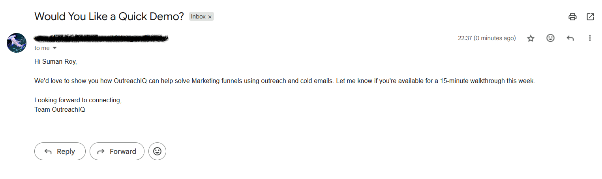


##### View created or scheduled flows 
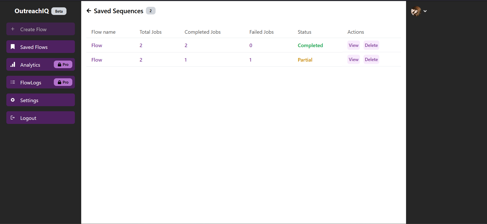


##### View details of each flow 
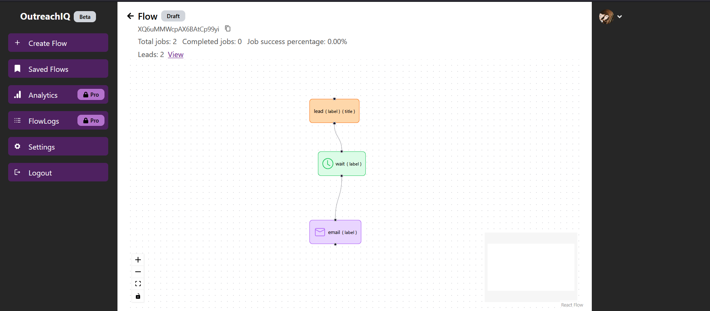

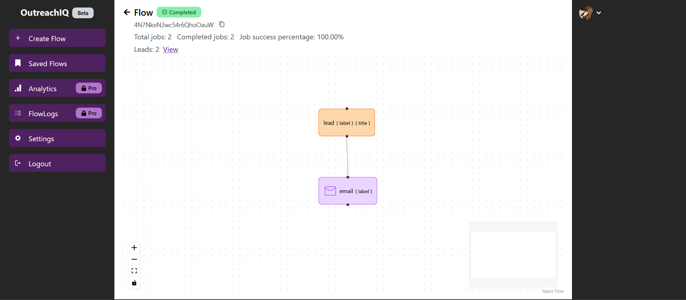


##### View analytics for better insights to your flow performances 
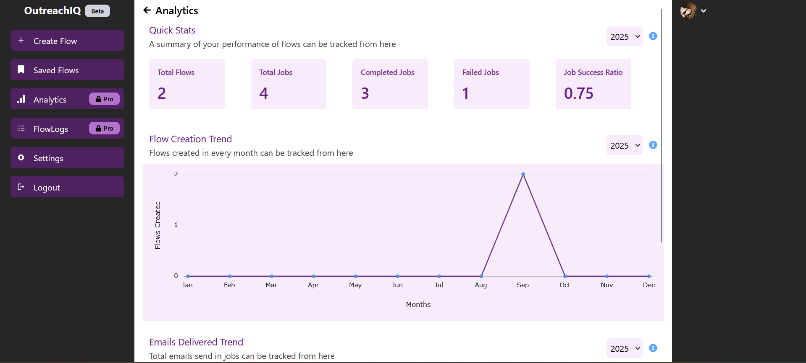

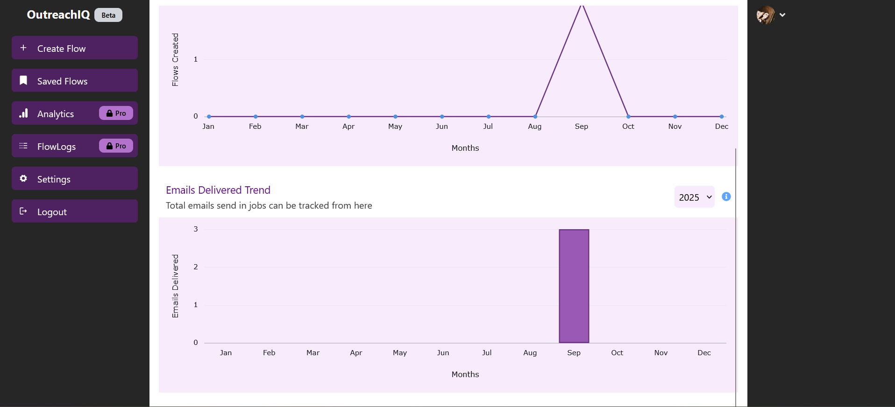


#####  View profile details and subscription details
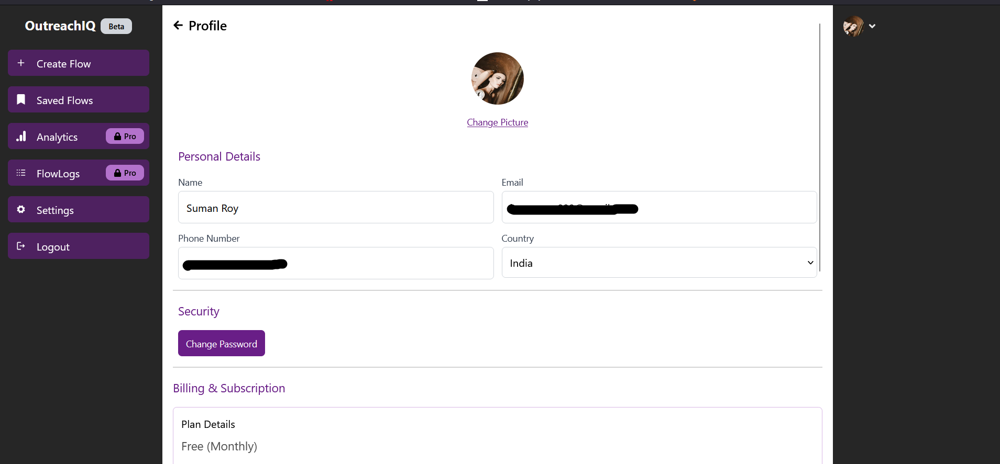

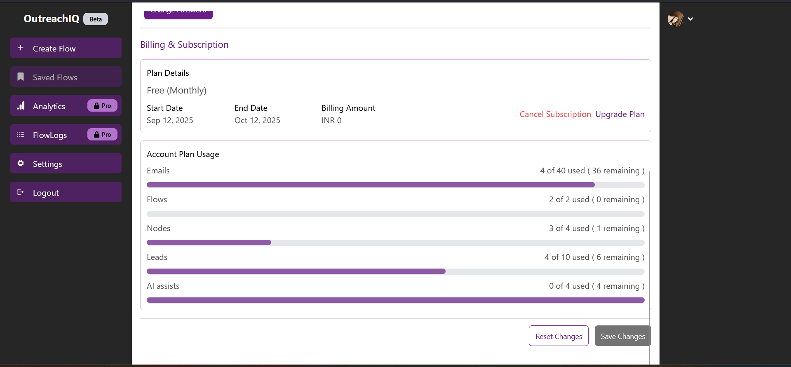


#####  View settings page 
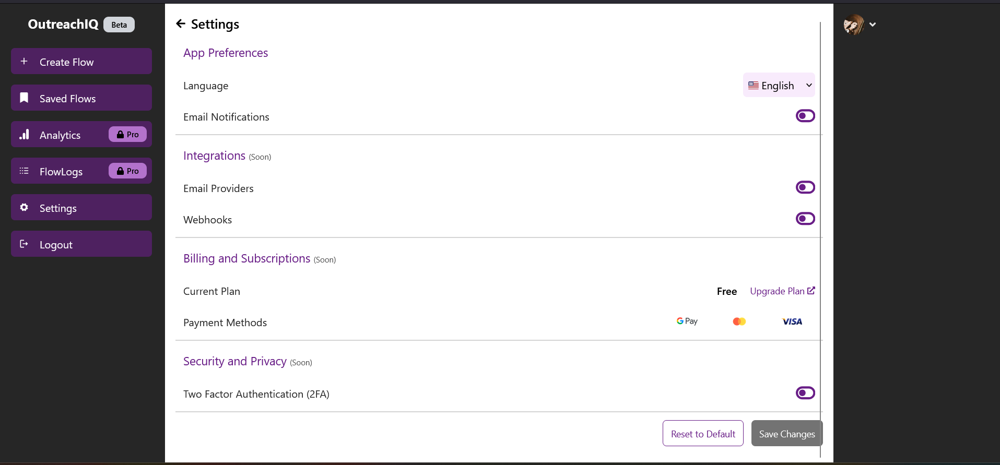


##### Logout confirmation
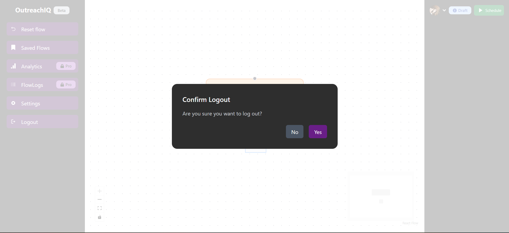

##### Contact page
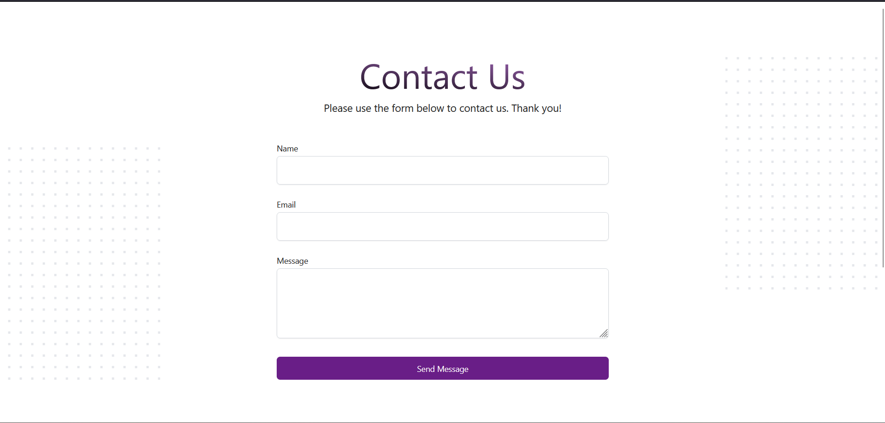

---

### Local Development & Setup

```bash
# Clone the repo
git clone https://github.com/Suman373/outreachiq.git

# Move to the project 
cd outreachiq

# Change directory to client and server using
cd client
cd server

# Install dependencies in both dir 
npm install

# Run the client locally
npm run dev

# Start the server locally
npm run dev

# Run redis with docker 
npm run redis-start

# To stop the container
npm run redis-stop

# To run tests
npm run test
```

---

### Future Scope
<!-- - 📌 **Deployment** – Hosting frontend (Vercel/Netlify) and backend (Render/Heroku)   -->
- **Two-factor authentication** - Additional layer of security
- **Logs Visualization** –  Live view of jobs being executed and the logs related to each successful delivery. 
- **Enhanced Analytics** – Graphs/charts for outreach campaign performance, lead conversion, CTR and other metrics
- **Retry Logic** – Automatic retries for failed jobs
- **Role-based Access Control** – Multi-user/team support for campaigns  


---

### License


---

### Feedback

We’d love to hear your thoughts and suggestions to improve this project!
If you have any feedback, questions, or ideas for new features, feel free to reach out:

Email: reachsuman.roy@gmail.com

---


### 
